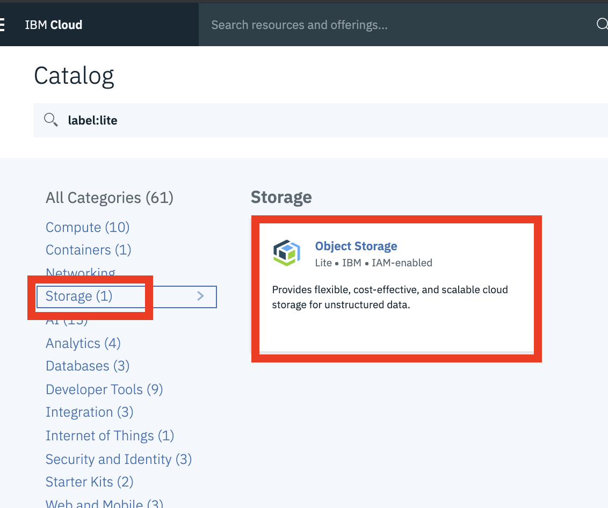
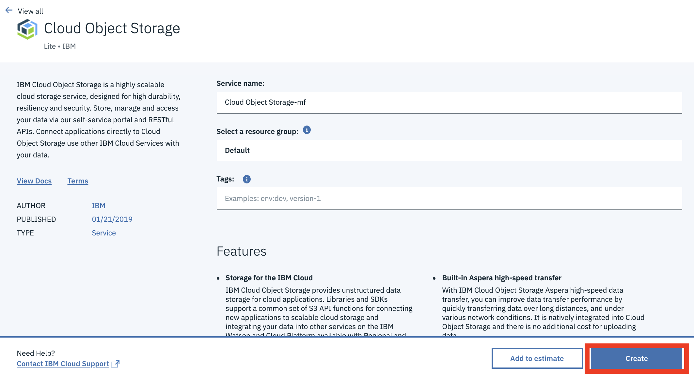
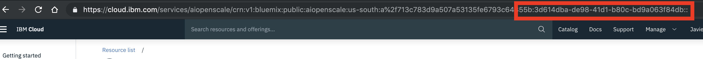

# Machine Learning: Monitor WML model with Watson OpenScale

IBM Watson OpenScale is an open environment that enables organizations to automate and operationalize their AI. OpenScale provides a powerful platform for managing AI and ML models. Learn how to train, create and deploy a machine learning model using Jupyter Notebook and Watson Studio. Use OpenScale to log payload and monitor performance, quality, and fairness of the model. Some additional resources are below:

* [Watson OpenScale Documentation](https://cloud.ibm.com/docs/services/ai-openscale?topic=ai-openscale-gettingstarted#gettingstarted)
* [Introduction Video](https://www.youtube.com/watch?v=udSKUkGANHA&t=2s)
* [IBM Developer Code Patterns for OpenScale](https://developer.ibm.com/?s=openscale&orderby=date&order=DESC&post_type%5B%5D=ibmcode_patterns)
* [Code Pattern for this lab](https://developer.ibm.com/patterns/monitor-performance-fairness-and-quality-of-a-wml-model-with-ai-openscale-apis/)

## Prerequisites

This lab will guide you through building a Spark ML based model to determine if an applicants credit risk. Some familiarity with Machine Learning will be useful in understanding the model, though not necessary as all the code is provided for you to build the credit risk model. Once the model is built, Watson OpenScale will be used to monitor the models fairness, performance and explain the results of transactions. To run through the lab, you will need:
* An IBM Cloud ID

## Instructions

In order to run the lab, you should go through the following steps to set up the Watson Studio environment where the Machine Learning model will be created.

1. Go to the [IBM Cloud console]((https://cloud.ibm.com)) - (https://cloud.ibm.com) and log in (or create an account if you do not have one).

1. Click on the **`Catalog`** link in the top banner of the IBM Cloud dashboard.  
   

1. Select the AI category on the left, under `All Categories`.  
   

1. Select the Watson Studio service tile.  
   

1. Leave the default options and click the **`Create`** button.  
   

1. On the service page. Right click on the **`Get Started`** button and select to open in a new tab to open the Watson Studio tooling.  
   

1. Still in the IBM Cloud console page, Click on the **`Catalog`** link in the top banner of the IBM Cloud dashboard.  

1. Select the 'Storage' category on the left, under `All Categories`. Then select the 'Object Storage' service tile.
   

1. Leave the default options, using the Lite plan and click the **`Create`** button.  
   

1. You can now follow the instructions for the code pattern found at the following [git repo](https://github.com/IBM/monitor-wml-model-with-watson-openscale/blob/master/README.md) to complete this lab.

### Tips and Work Arounds

Some tips, tricks and work arounds that might be useful while running through the Code Pattern tutorial:

1. The tutorial uses the IBM Cloud CLI to get the OpenScale service guids. If you do not have the CLI installed, you can find the GUID in the browser url. When you open the Watson Open Scale service instance on the IBM Cloud page, you will see in the url a location where the service is deployed followed by two alphanumerics separated by a colon. The service GUID is the second alphanumeric (after the colon and followed by two colons)
   

## Call to Action

Continue exploring Watson OpenScale and Watson Machine Learning through the following resources:
* https://github.com/pmservice/ai-openscale-tutorials/tree/master/notebooks

Join the 2019 Call for Code challenge today!
* https://developer.ibm.com/callforcode/
* https://developer.ibm.com/code-and-response/technologies/data-science

[Top](./)